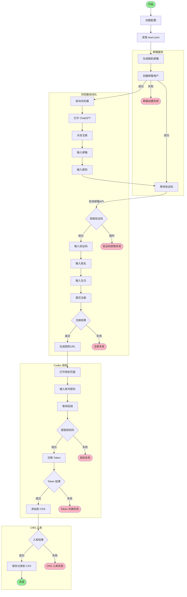

# OaiTeamCrsRegister

OpenAI Team 账号自动注册 & CRS 入库工具

## 流程图

```
┌──────────────────────────────────────────────────────────────────────┐
│                              开始                                     │
│                         python run.py                                │
└──────────────────────────────┬───────────────────────────────────────┘
                               ▼
┌──────────────────────────────────────────────────────────────────────┐
│  1. 加载配置                                                          │
│     ├── config.toml → 邮箱API/CRS/浏览器参数                          │
│     └── team.json   → Team凭证 (accessToken, account_id)             │
└──────────────────────────────┬───────────────────────────────────────┘
                               ▼
┏━━━━━━━━━━━━━━━━━━━━━━━━━━━━━━━━━━━━━━━━━━━━━━━━━━━━━━━━━━━━━━━━━━━━━━┓
┃  for team in TEAMS:                                    [外层循环]     ┃
┣━━━━━━━━━━━━━━━━━━━━━━━━━━━━━━━━━━━━━━━━━━━━━━━━━━━━━━━━━━━━━━━━━━━━━━┫
┃                              ▼                                        ┃
┃  ┌────────────────────────────────────────────────────────────────┐  ┃
┃  │  阶段1: 批量创建邮箱 (ACCOUNTS_PER_TEAM=4)                      │  ┃
┃  │  ──────────────────────────────────────────                    │  ┃
┃  │  • 随机选择域名: kyx03.de / kyx.mom / 114514222.de             │  ┃
┃  │  • 生成格式: {random}oaiteam@{domain}                          │  ┃
┃  │  • POST /api/public/addUser 创建邮箱用户                        │  ┃
┃  │  • 输出: [{email, password}, {email, password}, ...]           │  ┃
┃  └────────────────────────────────┬───────────────────────────────┘  ┃
┃                                   ▼                                   ┃
┃  ┌────────────────────────────────────────────────────────────────┐  ┃
┃  │  阶段2: 批量邀请到 Team                                         │  ┃
┃  │  ──────────────────────────────────────────                    │  ┃
┃  │  POST https://chatgpt.com/backend-api/accounts/{id}/invites    │  ┃
┃  │  Headers:                                                      │  ┃
┃  │    Authorization: Bearer {team.accessToken}                    │  ┃
┃  │    chatgpt-account-id: {team.account_id}                       │  ┃
┃  │  Body:                                                         │  ┃
┃  │    {"email_addresses": ["a@x.com","b@x.com",...], "role":...}  │  ┃
┃  └────────────────────────────────┬───────────────────────────────┘  ┃
┃                                   ▼                                   ┃
┃  ┏━━━━━━━━━━━━━━━━━━━━━━━━━━━━━━━━━━━━━━━━━━━━━━━━━━━━━━━━━━━━━━━━┓  ┃
┃  ┃  for email in invited_emails:                   [内层循环]     ┃  ┃
┃  ┣━━━━━━━━━━━━━━━━━━━━━━━━━━━━━━━━━━━━━━━━━━━━━━━━━━━━━━━━━━━━━━━━┫  ┃
┃  ┃                           ▼                                    ┃  ┃
┃  ┃  ┌──────────────────────────────────────────────────────────┐ ┃  ┃
┃  ┃  │  阶段3a: 启动浏览器 + 自动注册                            │ ┃  ┃
┃  ┃  │  ────────────────────────────────────                    │ ┃  ┃
┃  ┃  │  1. undetected-chromedriver 启动                         │ ┃  ┃
┃  ┃  │  2. 打开 https://chat.openai.com                         │ ┃  ┃
┃  ┃  │  3. 点击 Sign up → 输入邮箱 → 输入密码                    │ ┃  ┃
┃  ┃  │  4. 轮询邮箱API获取验证码 → 输入验证码                    │ ┃  ┃
┃  ┃  │  5. 输入姓名 + 生日 → 提交完成注册                        │ ┃  ┃
┃  ┃  └──────────────────────────────┬───────────────────────────┘ ┃  ┃
┃  ┃                                 ▼                              ┃  ┃
┃  ┃  ┌──────────────────────────────────────────────────────────┐ ┃  ┃
┃  ┃  │  阶段3b: Codex 授权 (同一浏览器会话)                      │ ┃  ┃
┃  ┃  │  ────────────────────────────────────                    │ ┃  ┃
┃  ┃  │  1. POST /admin/openai-accounts/generate-auth-url        │ ┃  ┃
┃  ┃  │     → 获取 authUrl + sessionId                           │ ┃  ┃
┃  ┃  │  2. 浏览器打开 authUrl → 自动输入邮箱密码                 │ ┃  ┃
┃  ┃  │  3. 等待回调 localhost:1455/auth/callback?code=xxx       │ ┃  ┃
┃  ┃  │  4. POST /admin/openai-accounts/exchange-code            │ ┃  ┃
┃  ┃  │     → 获取 idToken, accessToken, refreshToken            │ ┃  ┃
┃  ┃  └──────────────────────────────┬───────────────────────────┘ ┃  ┃
┃  ┃                                 ▼                              ┃  ┃
┃  ┃  ┌──────────────────────────────────────────────────────────┐ ┃  ┃
┃  ┃  │  阶段3c: CRS 入库                                         │ ┃  ┃
┃  ┃  │  ────────────────────────────────────                    │ ┃  ┃
┃  ┃  │  POST {CRS_API_BASE}/admin/openai-accounts               │ ┃  ┃
┃  ┃  │  Body: {name, openaiOauth: {tokens...}, accountInfo}     │ ┃  ┃
┃  ┃  └──────────────────────────────┬───────────────────────────┘ ┃  ┃
┃  ┃                                 ▼                              ┃  ┃
┃  ┃  ┌──────────────────────────────────────────────────────────┐ ┃  ┃
┃  ┃  │  阶段3d: 保存记录                                         │ ┃  ┃
┃  ┃  │  ────────────────────────────────────                    │ ┃  ┃
┃  ┃  │  • accounts.csv (email, password, team, status, crs_id)  │ ┃  ┃
┃  ┃  │  • team_tracker.json (追踪每个Team的账号状态)             │ ┃  ┃
┃  ┃  └──────────────────────────────┬───────────────────────────┘ ┃  ┃
┃  ┃                                 ▼                              ┃  ┃
┃  ┃                    等待 5-15s → 下一个邮箱                     ┃  ┃
┃  ┗━━━━━━━━━━━━━━━━━━━━━━━━━━━━━━━━━━━━━━━━━━━━━━━━━━━━━━━━━━━━━━━━┛  ┃
┃                                   ▼                                   ┃
┃                      等待 10-30s → 下一个 Team                        ┃
┗━━━━━━━━━━━━━━━━━━━━━━━━━━━━━━━━━━━━━━━━━━━━━━━━━━━━━━━━━━━━━━━━━━━━━━┛
                               ▼
┌──────────────────────────────────────────────────────────────────────┐
│                           打印执行摘要                                │
│                           全部完成 ✅                                 │
└──────────────────────────────────────────────────────────────────────┘
```

### 简化视图

```
run.py
  │
  └─► for team in TEAMS (4个):
        │
        ├─► 1. batch_create_emails(4)     → 创建4个邮箱
        │
        ├─► 2. batch_invite_to_team()     → 一次性邀请4个邮箱到Team
        │
        └─► 3. for email in 4个邮箱:
              │
              ├─► register_and_authorize()  → 浏览器注册+Codex授权
              │     ├── 打开ChatGPT注册页
              │     ├── 填写邮箱/密码
              │     ├── 获取验证码 (轮询邮箱API)
              │     ├── 完成注册
              │     └── Codex OAuth授权
              │
              ├─► crs_add_account()         → Token入库CRS
              │
              └─► save_to_csv()             → 保存记录

总计: 4 Teams × 4 账号 = 16 个 CRS 账号
```

<details>
<summary>Mermaid 版本 (GitHub 可见)</summary>



</details>

## 模块说明

```
├── config.py              # 配置加载 (config.toml + team.json)
├── config.toml            # 应用配置文件
├── team.json              # Team 账号凭证
├── email_service.py       # 邮箱服务 (创建用户、获取验证码)
├── browser_automation.py  # 浏览器自动化 (注册、授权)
├── crs_service.py         # CRS 服务 (授权、入库)
├── utils.py               # 工具函数 (CSV、记录追踪)
└── run.py                 # 入口脚本
```

## 配置说明

### config.toml

```toml
[email]
api_base = "https://your-email-api.com/api/public"
api_auth = "your-api-auth-token"
domains = ["domain1.com", "domain2.com"]

[crs]
api_base = "https://your-crs-api.com"
admin_token = "your-admin-token"

[account]
default_password = "your-password"
```

### team.json

```json
[
  {
    "user": { "email": "...", "id": "..." },
    "account": { "id": "...", "organizationId": "..." },
    "accessToken": "..."
  }
]
```

## 使用

```bash
# 安装依赖
uv sync

# 运行
uv run python run.py
```
