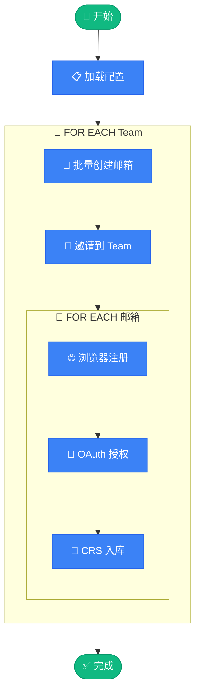

# 🚀 OpenAI Team Auto Provisioner

<div align="center">

**OpenAI Team 账号自动批量注册 & CRS 入库工具**

[](https://www.python.org/)
[](https://drissionpage.cn/)
[](LICENSE)

</div>

---

## ✨ 功能特性

- 🔄 **全自动化流程** - 从邮箱创建到 CRS 入库一键完成
- 📧 **批量邮箱创建** - 支持多域名随机生成邮箱
- 👥 **Team 批量邀请** - 一次性邀请多个账号到 Team
- 🌐 **浏览器自动化** - 基于 DrissionPage 的智能注册
- 🔐 **OAuth 自动授权** - Codex 授权流程全自动处理
- 💾 **断点续传** - 支持中断恢复，避免重复操作
- 📊 **状态追踪** - 详细的账号状态记录与追踪

---

## 📋 前置要求

- Python 3.12+
- [uv](https://github.com/astral-sh/uv) (推荐) 或 pip
- Chrome 浏览器
- 邮箱服务 API
- CRS 服务 API

---

## 🛠️ 快速开始

### 1. 安装依赖

```bash
# 使用 uv (推荐)
uv sync

# 或使用 pip
pip install -r requirements.txt
```

### 2. 配置文件

```bash
# 复制配置模板
cp config.toml.example config.toml
cp team.json.example team.json
```

### 3. 编辑配置

#### `config.toml` - 主配置文件

```toml
# 邮箱服务配置
[email]
api_base = "https://your-email-service.com/api/public"
api_auth = "your-api-auth-token"
domains = ["domain1.com", "domain2.com"]

# CRS 服务配置
[crs]
api_base = "https://your-crs-service.com"
admin_token = "your-admin-token"

# 账号配置
[account]
default_password = "YourSecurePassword@2025"
accounts_per_team = 4

# 更多配置项请参考 config.toml.example
```

#### `team.json` - Team 凭证配置

> 💡 通过访问 `https://chatgpt.com/api/auth/session` 获取（需先登录 ChatGPT）

```json
[
  {
    "user": {
      "id": "user-xxxxxxx",
      "email": "team-admin@example.com"
    },
    "account": {
      "id": "xxxxxxxx-xxxx-xxxx-xxxx-xxxxxxxxxxxx",
      "organizationId": "org-xxxxxxxxxxxxxxxxxxxxxxxx"
    },
    "accessToken": "eyJhbGciOiJSUzI1NiIs..."
  }
]
```

### 4. 运行

```bash
# 运行所有 Team
uv run python run.py

# 单个 Team 模式
uv run python run.py single

# 测试模式 (仅创建邮箱和邀请)
uv run python run.py test

# 查看状态
uv run python run.py status

# 帮助信息
uv run python run.py help
```

---

## 📁 项目结构

```
oai-team-auto-provisioner/
│
├── 🚀 run.py                 # 主入口脚本
├── ⚙️  config.py              # 配置加载模块
│
├── 📧 email_service.py       # 邮箱服务 (创建用户、获取验证码)
├── 👥 team_service.py        # Team 服务 (邀请管理)
├── 🌐 browser_automation.py  # 浏览器自动化 (注册流程)
├── 🔐 crs_service.py         # CRS 服务 (OAuth授权、入库)
│
├── 🛠️  utils.py               # 工具函数 (CSV、状态追踪)
├── 📊 logger.py              # 日志模块
│
├── 📝 config.toml.example    # 配置模板
├── 🔑 team.json.example      # Team 凭证模板
│
└── 📂 自动生成文件
    ├── accounts.csv          # 账号记录
    └── team_tracker.json     # 状态追踪
```

---

## 🔄 工作流程

```
                           ╭──────────────────────╮
                           │   🚀 python run.py   │
                           ╰──────────┬───────────╯
                                      │
                           ╭──────────▼───────────╮
                           │    📋 加载配置        │
                           │ config + team.json   │
                           ╰──────────┬───────────╯
                                      │
    ┏━━━━━━━━━━━━━━━━━━━━━━━━━━━━━━━━━▼━━━━━━━━━━━━━━━━━━━━━━━━━━━━━━━━━━┓
    ┃                                                                    ┃
    ┃   🔄 FOR EACH Team                                                 ┃
    ┃   ════════════════                                                 ┃
    ┃                                                                    ┃
    ┃      ┌─────────────────────────────────────────────────────┐       ┃
    ┃      │  📧 STEP 1 │ 批量创建邮箱                            │       ┃
    ┃      │            │ 随机域名 → API 创建 → 返回邮箱列表      │       ┃
    ┃      └─────────────────────────────┬───────────────────────┘       ┃
    ┃                                    ▼                               ┃
    ┃      ┌─────────────────────────────────────────────────────┐       ┃
    ┃      │  👥 STEP 2 │ 批量邀请到 Team                         │       ┃
    ┃      │            │ POST /backend-api/invites              │       ┃
    ┃      └─────────────────────────────┬───────────────────────┘       ┃
    ┃                                    ▼                               ┃
    ┃      ┌ ─ ─ ─ ─ ─ ─ ─ ─ ─ ─ ─ ─ ─ ─ ─ ─ ─ ─ ─ ─ ─ ─ ─ ─ ─ ┐       ┃
    ┃                                                                    ┃
    ┃      │  🔄 FOR EACH 邮箱账号                               │       ┃
    ┃         ─────────────────────                                      ┃
    ┃      │                                                     │       ┃
    ┃            ┌───────────────────────────────────────┐               ┃
    ┃      │     │  🌐 STEP 3 │ 浏览器自动注册            │      │       ┃
    ┃            │            │ 打开页面 → 填写信息 → 验证 │              ┃
    ┃      │     └─────────────────────┬─────────────────┘      │       ┃
    ┃                                  ▼                                 ┃
    ┃      │     ┌───────────────────────────────────────┐      │       ┃
    ┃            │  🔐 STEP 4 │ OAuth 授权                │               ┃
    ┃      │     │            │ 授权链接 → 登录 → Token   │      │       ┃
    ┃            └─────────────────────┬─────────────────┘               ┃
    ┃      │                           ▼                         │       ┃
    ┃            ┌───────────────────────────────────────┐               ┃
    ┃      │     │  💾 STEP 5 │ CRS 入库                  │      │       ┃
    ┃            │            │ 保存 Token → 写入 CSV     │              ┃
    ┃      │     └───────────────────────────────────────┘      │       ┃
    ┃                                                                    ┃
    ┃      └ ─ ─ ─ ─ ─ ─ ─ ─ ─ ─ ─ ─ ─ ─ ─ ─ ─ ─ ─ ─ ─ ─ ─ ─ ─ ┘       ┃
    ┃                                                                    ┃
    ┗━━━━━━━━━━━━━━━━━━━━━━━━━━━━━━━━━┳━━━━━━━━━━━━━━━━━━━━━━━━━━━━━━━━━━┛
                                      │
                           ╭──────────▼───────────╮
                           │   ✅ 完成 打印摘要    │
                           ╰──────────────────────╯
```

### 详细流程

| 阶段 | 操作 | 说明 |
|:---:|------|------|
| 📧 | **创建邮箱** | 随机选择域名，调用 Cloud Mail API 批量创建邮箱账号 |
| 👥 | **Team 邀请** | 使用 Team 管理员 Token 一次性邀请所有邮箱 |
| 🌐 | **浏览器注册** | DrissionPage 自动化完成 ChatGPT 注册流程 |
| 🔐 | **OAuth 授权** | 生成授权链接，自动登录获取 Codex Token |
| 💾 | **CRS 入库** | 将 Token 信息保存到 CRS 服务并记录到本地 CSV |

<details>
<summary>📊 Mermaid 流程图 (点击展开)</summary>



</details>

---

## 📊 输出文件

| 文件 | 说明 |
|------|------|
| `accounts.csv` | 所有账号记录 (邮箱、密码、Team、状态、CRS ID) |
| `team_tracker.json` | 每个 Team 的账号处理状态追踪 |

---

## ⚙️ 完整配置参考

<details>
<summary>点击展开 config.toml 完整配置</summary>

```toml
# ==================== 邮箱服务配置 ====================
[email]
api_base = "https://your-email-service.com/api/public"
api_auth = "your-api-auth-token"
domains = ["example.com", "example.org"]
role = "gpt-team"
web_url = "https://your-email-service.com"

# ==================== CRS 服务配置 ====================
[crs]
api_base = "https://your-crs-service.com"
admin_token = "your-admin-token"

# ==================== 账号配置 ====================
[account]
default_password = "YourSecurePassword@2025"
accounts_per_team = 4

# ==================== 注册配置 ====================
[register]
name = "test"

[register.birthday]
year = "2000"
month = "01"
day = "01"

# ==================== 请求配置 ====================
[request]
timeout = 30
user_agent = "Mozilla/5.0 (Windows NT 10.0; Win64; x64) Chrome/135.0.0.0"

# ==================== 验证码配置 ====================
[verification]
timeout = 60
interval = 3
max_retries = 20

# ==================== 浏览器配置 ====================
[browser]
wait_timeout = 60
short_wait = 10

# ==================== 文件配置 ====================
[files]
csv_file = "accounts.csv"
tracker_file = "team_tracker.json"
```

</details>

---

## 🤝 相关项目

此工具需要配合以下服务使用：

### 📧 邮箱服务 - Cloud Mail

本项目使用 [**Cloud Mail**](https://github.com/maillab/cloud-mail) 作为临时邮箱服务，用于创建邮箱账号和获取验证码。

- **项目地址**: [https://github.com/maillab/cloud-mail](https://github.com/maillab/cloud-mail)
- **API 文档**: [https://doc.skymail.ink/api/api-doc.html](https://doc.skymail.ink/api/api-doc.html)

> 💡 **获取 API Token**: 请参考 [API 文档](https://doc.skymail.ink/api/api-doc.html) 了解如何获取 `api_auth` token，然后填入 `config.toml` 的 `[email]` 配置中。

### 🔐 CRS 服务

ChatGPT Refresh Service - 用于 OAuth Token 管理、刷新和账号入库。

---

## ⚠️ 免责声明

本项目仅供学习和研究使用。使用者需自行承担使用风险，请遵守相关服务条款。

---

## 📄 License

[MIT](LICENSE)
