# 🚀 OpenAI Team Auto Provisioner

<div align="center">

**OpenAI Team 账号自动批量注册 & CRS 入库工具**

[](https://www.python.org/)
[](https://drissionpage.cn/)
[](LICENSE)

</div>

---

## ✨ 功能特性

- 🔄 **全自动化流程** - 从邮箱创建到 CRS 入库一键完成
- 📧 **批量邮箱创建** - 支持多域名随机生成邮箱
- 👥 **Team 批量邀请** - 一次性邀请多个账号到 Team
- 🌐 **浏览器自动化** - 基于 DrissionPage 的智能注册
- 🔐 **OAuth 自动授权** - Codex 授权流程全自动处理
- 💾 **断点续传** - 支持中断恢复，避免重复操作
- 📊 **状态追踪** - 详细的账号状态记录与追踪

---

## 📋 前置要求

- Python 3.12+
- [uv](https://github.com/astral-sh/uv) (推荐) 或 pip
- Chrome 浏览器
- 邮箱服务 API
- CRS 服务 API

---

## 🛠️ 快速开始

### 1. 安装依赖

```bash
# 使用 uv (推荐)
uv sync

# 或使用 pip
pip install -r requirements.txt
```

### 2. 配置（程序内置，推荐）

> 配置通过 GUI 保存到**程序内部存储**（Windows：当前用户注册表），不再需要在目录里维护 `config.toml` / `team.json`。

```bash
# 启动 GUI（推荐）
python -m webview_gui
```

- 在 GUI「配置编辑」页点击“从 example 生成”
- 填写并点击“保存配置”
- 保存后 CLI（`python run.py`）和 GUI 会共用同一份配置

### 3. 配置内容说明（在 GUI 中编辑）

#### `config.toml` - 主配置文件

```toml
# 邮箱配置（两种模式二选一：Cloud Mail 或 GPTMail）
[email]
# 1) Cloud Mail（默认）
api_base = "https://your-email-service.com/api/public"
api_auth = "your-api-auth-token"
domains = ["domain1.com", "domain2.com"]

# 2) GPTMail 随机邮箱（可选，启用后将忽略上面的 Cloud Mail 配置）
use_gptmail = false
gptmail_api_base = "https://mail.chatgpt.org.uk"
gptmail_api_key = "gpt-test"

# CRS 服务配置
[crs]
api_base = "https://your-crs-service.com"
admin_token = "your-admin-token"

# 账号配置
[account]
default_password = "YourSecurePassword@2025"
accounts_per_team = 4

# 更多配置项请参考 config.toml.example
```

#### `team.json` - Team 凭证配置

> 💡 通过访问 `https://chatgpt.com/api/auth/session` 获取（需先登录 ChatGPT）

```json
[
  {
    "user": {
      "id": "user-xxxxxxx",
      "email": "team-admin@example.com"
    },
    "account": {
      "id": "xxxxxxxx-xxxx-xxxx-xxxx-xxxxxxxxxxxx",
      "organizationId": "org-xxxxxxxxxxxxxxxxxxxxxxxx"
    },
    "accessToken": "eyJhbGciOiJSUzI1NiIs..."
  }
]
```

### 4. 运行

```bash
# 运行所有 Team
uv run python run.py

# 单个 Team 模式
uv run python run.py single

# 测试模式 (仅创建邮箱和邀请)
uv run python run.py test

# 查看状态
uv run python run.py status

# 帮助信息
uv run python run.py help
```

### 5. 图形化界面（pywebview WebView GUI）

> 适合 Windows 一键运行/打包，界面更现代；尽量不改动现有业务代码。
>
> 前置条件：Windows 需要安装 **Microsoft Edge WebView2 Runtime**（多数系统已自带；缺失时程序会弹窗提示下载地址）。

```bash
# 安装依赖（任选其一）
uv sync
# 或：pip install -r requirements.txt

# 源码运行
python -m webview_gui

# 打包为单文件 EXE（Windows）
powershell -ExecutionPolicy Bypass -File .\\scripts\\build_onefile.ps1
```

- 打包产物：`dist/oai-team-gui.exe`
- EXE 运行时：首次启动后在 GUI「配置编辑」页保存配置（配置存于程序内部存储，无需外置 `config.toml` / `team.json`）
- 新增模式：GUI「运行」页提供“批量注册 OpenAI（仅注册）”，支持邮箱来源选择（域名邮箱/随机邮箱）
- 输出记录：账号/凭据/追踪都写入程序内部存储；需要文件时在「数据/导出」页导出到 `工作目录/exports/`

---

## 📁 项目结构

```
oai-team-auto-provisioner/
│
├── 🚀 run.py                 # 主入口脚本
├── ⚙️  config.py              # 配置加载模块
├── 🖥️ gui_main.py            # GUI 打包入口（PyInstaller）
│
├── 📧 email_service.py       # 邮箱服务 (创建用户、获取验证码)
├── 👥 team_service.py        # Team 服务 (邀请管理)
├── 🌐 browser_automation.py  # 浏览器自动化 (注册流程)
├── 🔐 crs_service.py         # CRS 服务 (OAuth授权、入库)
│
├── 🛠️  utils.py               # 工具函数 (CSV、状态追踪)
├── 📊 logger.py              # 日志模块
├── 🧩 gui_core/              # GUI 后端共享模块（无界面）
├── 🌐 webview_gui/           # pywebview 图形界面（新版，独立目录）
├── 🧰 scripts/               # 打包/脚本
│
├── 📝 config.toml.example    # 配置模板
├── 🔑 team.json.example      # Team 凭证模板
│
└── 📂 自动生成文件
    ├── %LOCALAPPDATA%/OaiTeamAutoProvisioner/data.sqlite  # 内部输出记录（账号/凭据/追踪）
    └── exports/              # 手动导出时生成（CSV/JSON）
```

---

## 🔄 工作流程

```
                           ╭──────────────────────╮
                           │   🚀 python run.py   │
                           ╰──────────┬───────────╯
                                      │
                           ╭──────────▼───────────╮
                           │    📋 加载配置        │
                           │ config + team.json   │
                           ╰──────────┬───────────╯
                                      │
    ┏━━━━━━━━━━━━━━━━━━━━━━━━━━━━━━━━━▼━━━━━━━━━━━━━━━━━━━━━━━━━━━━━━━━━━┓
    ┃                                                                    ┃
    ┃   🔄 FOR EACH Team                                                 ┃
    ┃   ════════════════                                                 ┃
    ┃                                                                    ┃
    ┃      ┌─────────────────────────────────────────────────────┐       ┃
    ┃      │  📧 STEP 1 │ 批量创建邮箱                            │       ┃
    ┃      │            │ Cloud Mail / GPTMail → 返回邮箱列表     │       ┃
    ┃      └─────────────────────────────┬───────────────────────┘       ┃
    ┃                                    ▼                               ┃
    ┃      ┌─────────────────────────────────────────────────────┐       ┃
    ┃      │  👥 STEP 2 │ 批量邀请到 Team                         │       ┃
    ┃      │            │ POST /backend-api/invites              │       ┃
    ┃      └─────────────────────────────┬───────────────────────┘       ┃
    ┃                                    ▼                               ┃
    ┃      ┌ ─ ─ ─ ─ ─ ─ ─ ─ ─ ─ ─ ─ ─ ─ ─ ─ ─ ─ ─ ─ ─ ─ ─ ─ ─ ┐       ┃
    ┃                                                                    ┃
    ┃      │  🔄 FOR EACH 邮箱账号                               │       ┃
    ┃         ─────────────────────                                      ┃
    ┃      │                                                     │       ┃
    ┃            ┌───────────────────────────────────────┐               ┃
    ┃      │     │  🌐 STEP 3 │ 浏览器自动注册            │      │       ┃
    ┃            │            │ 打开页面 → 填写信息 → 验证 │              ┃
    ┃      │     └─────────────────────┬─────────────────┘      │       ┃
    ┃                                  ▼                                 ┃
    ┃      │     ┌───────────────────────────────────────┐      │       ┃
    ┃            │  🔐 STEP 4 │ OAuth 授权                │               ┃
    ┃      │     │            │ 授权链接 → 登录 → Token   │      │       ┃
    ┃            └─────────────────────┬─────────────────┘               ┃
    ┃      │                           ▼                         │       ┃
    ┃            ┌───────────────────────────────────────┐               ┃
    ┃      │     │  💾 STEP 5 │ CRS 入库                  │      │       ┃
    ┃            │            │ 保存 Token → 写入 CSV     │              ┃
    ┃      │     └───────────────────────────────────────┘      │       ┃
    ┃                                                                    ┃
    ┃      └ ─ ─ ─ ─ ─ ─ ─ ─ ─ ─ ─ ─ ─ ─ ─ ─ ─ ─ ─ ─ ─ ─ ─ ─ ─ ┘       ┃
    ┃                                                                    ┃
    ┗━━━━━━━━━━━━━━━━━━━━━━━━━━━━━━━━━┳━━━━━━━━━━━━━━━━━━━━━━━━━━━━━━━━━━┛
                                      │
                           ╭──────────▼───────────╮
                           │   ✅ 完成 打印摘要    │
                           ╰──────────────────────╯
```

### 详细流程

| 阶段 | 操作 | 说明 |
|:---:|------|------|
| 📧 | **创建邮箱** | 根据配置选择 Cloud Mail 或 GPTMail，批量生成邮箱地址 |
| 👥 | **Team 邀请** | 使用 Team 管理员 Token 一次性邀请所有邮箱 |
| 🌐 | **浏览器注册** | DrissionPage 自动化完成 ChatGPT 注册流程 |
| 🔐 | **OAuth 授权** | 生成授权链接，自动登录获取 Codex Token |
| 💾 | **CRS 入库** | 将 Token 信息保存到 CRS 服务并记录到本地 CSV |

```mermaid
flowchart TB
    Start([🚀 开始]):::startEnd --> Load[📋 加载配置]
    Load --> TeamLoop

    subgraph TeamLoop["🔁 FOR EACH Team"]
        direction TB
        Email[📧 批量创建邮箱] --> Invite[👥 邀请到 Team]
        Invite --> AccountLoop
        
        subgraph AccountLoop["🔁 FOR EACH 邮箱"]
            direction TB
            Register[🌐 浏览器注册] --> Auth[🔐 OAuth 授权]
            Auth --> CRS[💾 CRS 入库]
        end
    end

    TeamLoop --> Done([✅ 完成]):::startEnd

    classDef startEnd fill:#10b981,color:#fff,stroke:#059669
    classDef default fill:#3b82f6,color:#fff,stroke:#2563eb
```

<details>
<summary>📊 Mermaid 流程图 (点击展开)</summary>



</details>

---

## 📊 输出文件

- 默认不在工作目录生成 `accounts.csv` / `created_credentials.csv` / `team_tracker.json`
- 记录会写入程序内部存储（Windows：`%LOCALAPPDATA%/OaiTeamAutoProvisioner/data.sqlite`）
- 需要文件时：在 GUI「数据/导出」页导出到 `工作目录/exports/`

---

## ⚙️ 完整配置参考

<details>
<summary>点击展开 config.toml 完整配置</summary>

```toml
# ==================== 邮箱服务配置 ====================
[email]
api_base = "https://your-email-service.com/api/public"
api_auth = "your-api-auth-token"
domains = ["example.com", "example.org"]
role = "gpt-team"
web_url = "https://your-email-service.com"

# ==================== CRS 服务配置 ====================
[crs]
api_base = "https://your-crs-service.com"
admin_token = "your-admin-token"

# ==================== 账号配置 ====================
[account]
default_password = "YourSecurePassword@2025"
accounts_per_team = 4

# ==================== 注册配置 ====================
[register]
name = "test"

[register.birthday]
year = "2000"
month = "01"
day = "01"

# ==================== 请求配置 ====================
[request]
timeout = 30
user_agent = "Mozilla/5.0 (Windows NT 10.0; Win64; x64) Chrome/135.0.0.0"

# ==================== 验证码配置 ====================
[verification]
timeout = 60
interval = 3
max_retries = 20

# ==================== 浏览器配置 ====================
[browser]
wait_timeout = 60
short_wait = 10

# 输出记录已改为程序内部存储（无需配置 [files]）。
```

</details>

---

## 🤝 相关项目

此工具需要配合以下服务使用：

### 📧 邮箱服务 - Cloud Mail

本项目使用 [**Cloud Mail**](https://github.com/maillab/cloud-mail) 作为临时邮箱服务，用于创建邮箱账号和获取验证码。

- **项目地址**: [https://github.com/maillab/cloud-mail](https://github.com/maillab/cloud-mail)
- **API 文档**: [https://doc.skymail.ink/api/api-doc.html](https://doc.skymail.ink/api/api-doc.html)

> 💡 **获取 API Token**: 请参考 [API 文档](https://doc.skymail.ink/api/api-doc.html) 了解如何获取 `api_auth` token，然后填入 `config.toml` 的 `[email]` 配置中。

### 🔐 CRS 服务 - Claude Relay Service

本项目使用 [**Claude Relay Service**](https://github.com/Wei-Shaw/claude-relay-service) 作为 Token 管理服务，用于 OAuth 授权和账号入库。

- **项目地址**: [https://github.com/Wei-Shaw/claude-relay-service](https://github.com/Wei-Shaw/claude-relay-service)

> 💡 **配置说明**: 部署 CRS 服务后，将服务地址和管理员 Token 填入 `config.toml` 的 `[crs]` 配置中。

---

## ⚠️ 免责声明

本项目仅供学习和研究使用。使用者需自行承担使用风险，请遵守相关服务条款。

---

## 📄 License

[MIT](LICENSE)
